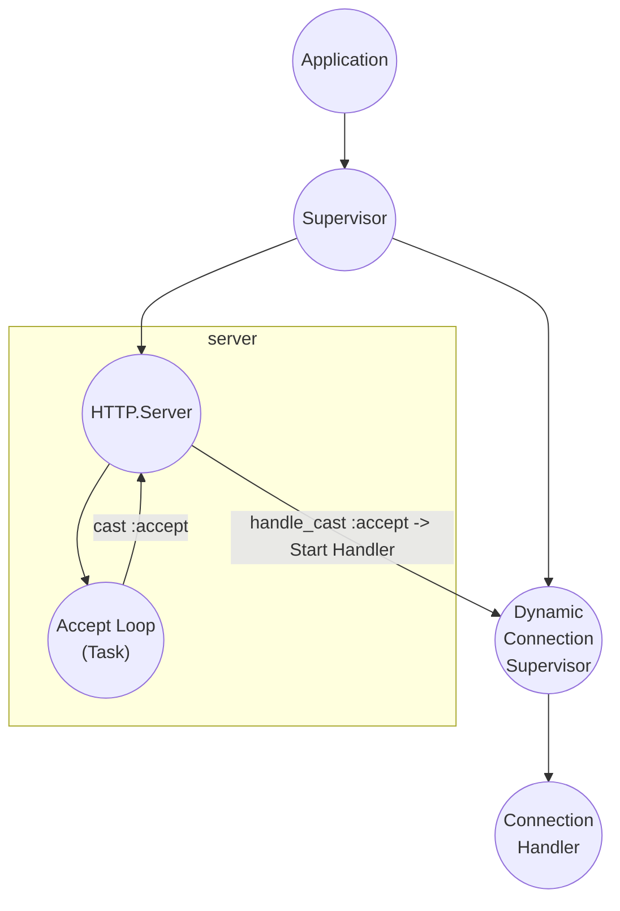
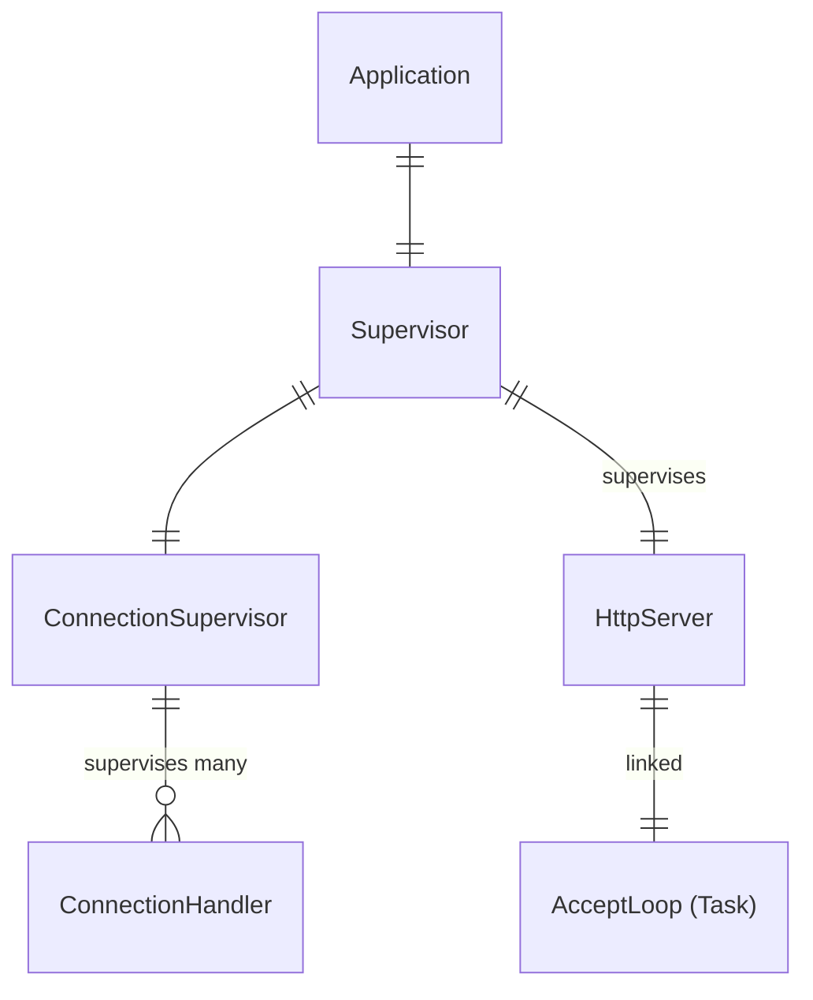
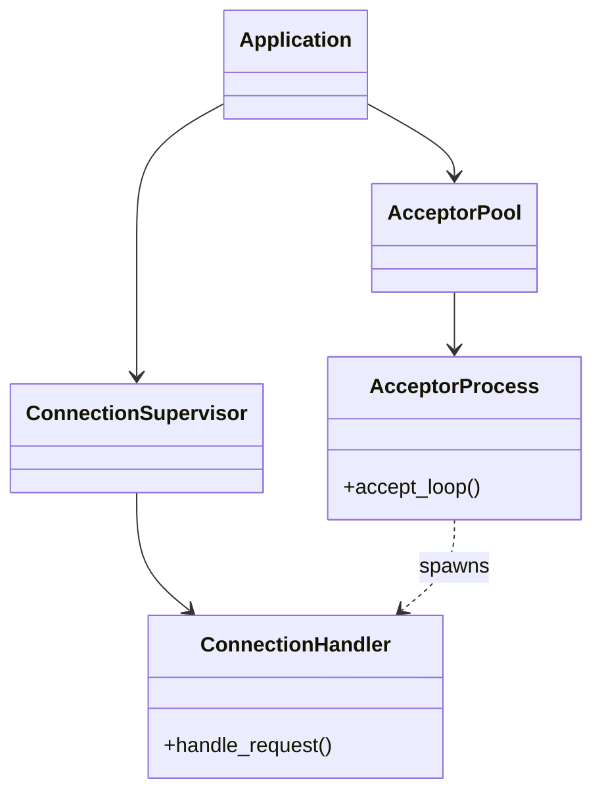

> **Disclamer:** This is not a tutorial! I'm documenting my learning journey. You might learn what _not_ to do and why, and hopefully gain a deeper understanding of Elixir along with me, but you won't learn how to build a proper HTTP server in Elixir.

**Commits:** 6344551 → 8b4e406 (Aug 12-14, 2025)

## Context

Before we can start implementing our WebSockets and the canvas logic, we need to build a basic HTTP server, and in sticking to our **no dependencies** mentality, we'll be using raw Elixir primitives -- no Phoenix, no Cowboy, no Plug, just Erlang's `:gen_tcp` and OTP.

The initial commit included a comprehensive test suite defining the expected server behavior: handling GET/POST requests, returning appropriate status codes, managing concurrent connections, and gracefully handling malformed input. These tests served as a contract for what needed to be built.

## Architecture

### GenServer as the Foundation

The server is structured as a GenServer (`PixelCanvas.Http.Server`) that manages the listening socket and spawns tasks to handle individual connections. This design separates concerns: the GenServer owns the socket lifecycle while ephemeral tasks handle request/response cycles.

The `init/1` callback establishes the TCP listener socket and immediately spawns an accept loop that runs continuously, blocking on `:gen_tcp.accept/1`. When a connection arrives, it spawns a new task for handling the request and immediately returns to accepting the next connection.

### TCP Socket Configuration

The socket initialization uses three packet modes across the request lifecycle:

1. **`:packet => :http_bin`** for parsing the initial request line and headers
2. **`:packet => :raw`** after receiving all headers, to read the body as raw bytes

This mode switching exploits Erlang's built-in HTTP parsing for the structured parts of the request while maintaining control over body handling. The `:http_bin` mode yields tuples like `{:http_request, method, {:abs_path, path}, version}` and `{:http_header, _, _, name, value}`, eliminating manual header parsing.

### Module Separation

Four modules emerged:

- **`Server`**: GenServer managing the listener socket and accept loop
- **`Request`**: Parsing incoming HTTP requests via pattern matching on `:gen_tcp.recv/2` results
- **`Response`**: Building HTTP responses with proper headers (Content-Length, Content-Type)
- **`Router`**: Mapping request paths to response generation

This separation proved necessary when handling errors. Request parsing could fail at multiple points (malformed start line, connection closed, invalid headers), and each failure mode needed distinct handling. The `Request.parse/1` function returns tagged tuples that `Server.handle_request/2` pattern matches to generate appropriate error responses.

## Implementation Details

### Request Parsing

The parsing flow in `Request.parse/1`:

1. Read the request line (method, path, HTTP version) using `:http_bin` packet mode
2. Recursively read headers until receiving `:http_eoh` (end of headers)
3. Switch to raw packet mode with `:inet.setopts/2`
4. Read the body using the Content-Length header value

Headers are accumulated in a map during the recursive calls. The initial implementation had no header normalization—header names are stored as received from the client, which works for the current use case but would require case-insensitive handling for full HTTP compliance.

### Response Preparation

The `Response.prepare/2` function handles two tasks:

1. Set Content-Length based on body size
2. Add Content-Encoding if the client accepts gzip (though compression isn't implemented yet)

The separation between `Response.prepare/2` and `Response.to_binary/1` reflects the difference between building response data and serializing it. This became relevant when adding default headers—preparation happens in the domain layer, serialization in the protocol layer.

### Connection Management

The GenServer tracks active connection counts. When a connection is accepted, it calls `:new_connection` to increment the counter. When `handle_request/2` completes, it calls `:close_connection` to decrement. This is primitive accounting but sufficient for the current phase.

The connection handler closes the socket regardless of whether parsing succeeds or fails. Keep-alive support wasn't needed yet.

## Testing Challenges

The test suite exposed several edge cases:

**Port Binding**: Tests initially failed due to port conflicts. Each test now uses a random port in the 5000+ range and proper cleanup with `on_exit/1` callbacks.

**Process Lifecycle**: Early tests attempted to stop an already-dead GenServer process, causing crashes. The `on_exit` callback now checks `Process.alive?/1` before stopping.

**Concurrent Requests**: The concurrent test spawns 10 tasks that simultaneously connect to the server. This revealed that the accept loop needed to be non-blocking—spawning tasks rather than handling requests inline in the accept loop process.

**Malformed Input**: When sending garbage to the server, the `:http_bin` packet mode doesn't automatically return a clean error—it often returns `{:http_error, binary}`. The request parser had to match on `{:http_error, reason}` specifically.

## What Was Learned

**Erlang's Packet Modes**: The `:gen_tcp` module's packet modes are a significant abstraction. Using `:http_bin` eliminated hundreds of lines of manual HTTP parsing code. Understanding when to switch modes (after headers, before body) required reading the documentation carefully.

**GenServer for TCP Servers**: The pattern of using a GenServer to own the listening socket while spawning ephemeral processes for connections is standard but not obvious. The initial approach tried to handle requests inside the GenServer, which created bottlenecks.

**Test-First Development**: Writing tests before implementation forced clarity about the module boundaries and error handling paths. Several design decisions (returning tagged tuples from `Request.parse/1`, separating routing from response generation) emerged from writing test cases first.

## Current State

The server handles basic HTTP/1.1 GET and POST requests, returns appropriate status codes, and manages concurrent connections without leaking resources. The tests pass consistently.

This foundation is sufficient for the next phase: implementing the WebSocket upgrade handshake and frame parsing. The HTTP server will evolve from serving simple text responses to negotiating protocol upgrades and maintaining long-lived bidirectional connections.

The implementation is ~250 lines of code across four modules. The test suite is ~125 lines. The ratio reflects the test-first approach and the deliberate avoidance of external dependencies. Everything that happens is visible in the source.
